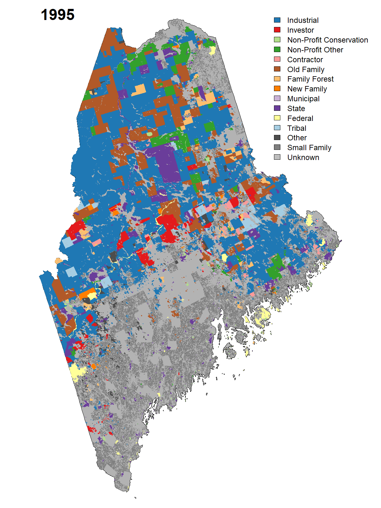

# The Effects of Ownership Changes on Forest Carbon Stock

This repository investigates how forest ownership change and financialization affect timber harvesting and forest carbon storage, with a primary focus on Maine. The workflow combines ownership records, Forest Inventory and Analysis (FIA) observations, remote-sensing products, and LANDIS-II simulations.

## Repository structure

- `src/base.R`: Shared paths, constants, and utility functions.
- `src/vis_owner_color.R`: The owner-type color palette used by figures.
- `src/01_ownership_timeseries/`: Builds ownership datasets and analyzes ownership transitions through time.
- `src/02_harvest_practices/`: Estimates and visualizes harvest rates, harvest intensity, and carbon outcomes by owner type.
- `src/03_landis_simulation/`: Prepares LANDIS-II inputs, runs scenarios, validates simulations, and summarizes carbon impacts.
- `pipe/`: Stores intermediate data products passed between scripts.
- `out/`: Stores final tables, figures, and other analysis outputs.

> [!NOTE]
> Scripts use paths relative to the repository root and should therefore be run from that directory. Some workflows also require data on external drives, which may not run by readers without valid data.

## Script naming style

Scripts were named under using following style:

- `dat_dl_`: Downloads or retrieves source data.
- `dat_pr_`: Cleans, transforms, or prepares data for analysis.
- `hlp_`: Reusable helper functions.
- `mod_`: Fits models, calculates estimates, runs simulations, or performs the main analysis.
- `vis_`: Visualize results.

>Data-preparation scripts generally run before model and visualization scripts.
